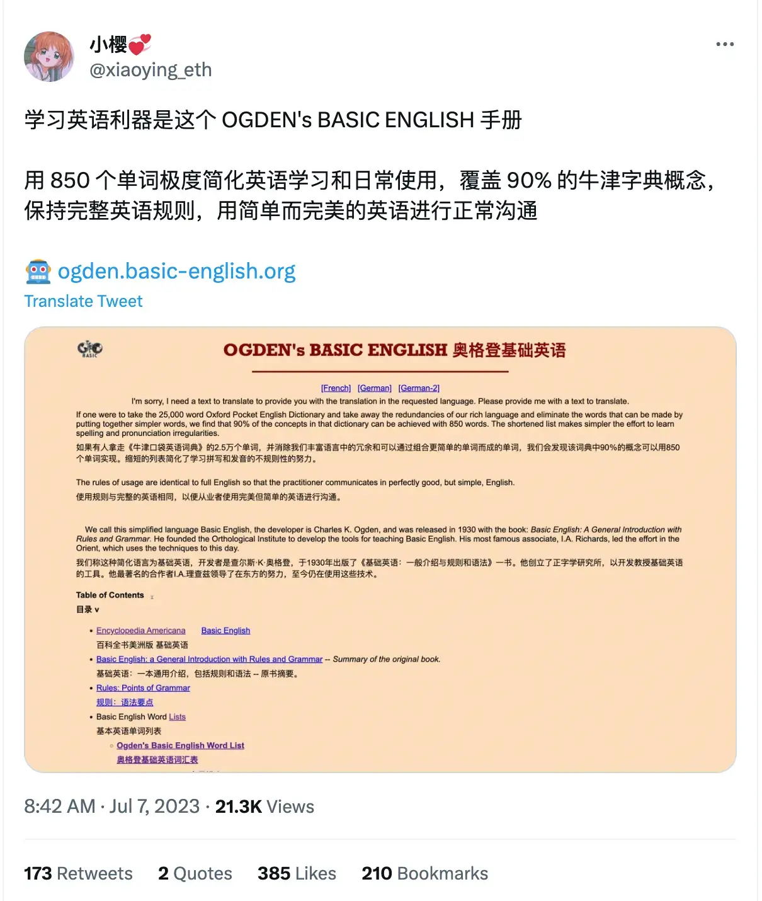

# BASIC-ENGLISH-VOCABULARY

学习英语利器是这个 OGDEN's BASIC ENGLISH 手册 用 850 个单词极度简化英语学习和日常使用，覆盖 90% 的牛津字典概念，保持完整英语规则，用简单而完美的英语进行正常沟通

 http://ogden.basic-english.org/words.html

使用GPT 生成 学习文本

> 使用 markdown 格式返回 参考 格式 参考 | 序号 | 单词       | Emoji  | 翻译   | 词性   | 使用频率 | 例句                                       | 例句翻译                                 | | ---- | ---------- | ------- | ------ | ------ | -------- | ------------------------------------------ | --------------------------------------- | | 1    | awake      | 😳☀️   | 醒着的 | 形容词 | ★★☆☆☆   | She lay awake all night, unable to sleep.  | 她整夜都醒着，无法入睡。                 |

### OPERATIONS - 100 words

- come, get, give, go, keep, let, make, put, seem, take, be, do, have, say, see, send, may, will,
  about, across, after, against, among, at, before, between, by, down, from, in, off, on, over, through, to, under, up, with,
  as, for, of, till, than,
  a , the, all, any, every, little, much, no, other, some, such, that, this, I , he, you, who,
  and, because, but, or, if, though, while, how, when, where, why,
  again, ever, far, forward, here, near, now, out, still, then, there, together, well,
  almost, enough, even, not, only, quite, so, very, tomorrow, yesterday,
  north, south, east, west, please, yes .
  
| 序号 | 单词    | Emoji | 翻译   | 词性   | 使用频率 | 例句                                             | 例句翻译                                       |
| ---- | ------- | ----- | ------ | ------ | -------- | ------------------------------------------------ | --------------------------------------------- |
| 1    | come    | 🚶‍♂️  | 来     | 动词   | ★★★★☆   | Please come to my house for dinner.               | 请来我家吃晚饭。                               |
| 2    | get     | 🛒    | 得到   | 动词   | ★★★★☆   | I need to get some groceries from the store.      | 我需要从商店买些杂货。                         |
| 3    | give    | 🎁    | 给予   | 动词   | ★★★☆☆   | She gave me a present on my birthday.             | 她在我的生日上给了我一个礼物。                 |
| 4    | go      | 🚶‍♀️  | 去     | 动词   | ★★★★☆   | Let's go for a walk in the park.                  | 我们去公园散步吧。                             |
| 5    | keep    | 🤲    | 保持   | 动词   | ★★★☆☆   | Please keep the door closed.                      | 请保持门关着。                                 |
| 6    | let     | 🙏    | 让     | 动词   | ★★★☆☆   | Can you let me borrow your pen?                   | 你可以借给我你的笔吗？                         |
| 7    | make    | 👷‍♂️  | 制造   | 动词   | ★★★★☆   | She made a delicious cake for the party.          | 她为派对做了一个美味的蛋糕。                 |
| 8    | put     | 📦    | 放置   | 动词   | ★★★☆☆   | Put your shoes on the shoe rack, please.          | 请把你的鞋子放在鞋架上。                       |
| 9    | seem    | 🧐    | 似乎   | 动词   | ★★★☆☆   | He seems to be upset about something.             | 他似乎对某事感到不快。                         |
| 10   | take    | 🤲    | 拿     | 动词   | ★★★★☆   | Take an umbrella with you.                        | 带一把伞走。                                   |
| 11   | be      | 💭    | 是     | 动词   | ★★★★★   | I am happy to see you.                            | 见到你我很高兴。                               |
| 12   | do      | ✅    | 做     | 动词   | ★★★★☆   | What do you want to do this weekend?              | 这个周末你想做什么？                           |
| 13   | have    | 🈶    | 有     | 动词   | ★★★★☆   | She has a beautiful garden in her backyard.       | 她后院有一个漂亮的花园。                       |
| 14   | say     | 🗣️    | 说     | 动词   | ★★★★☆   | Can you hear what I'm saying?                     | 你能听到我在说什么吗？                         |
| 15   | see     | 👀    | 看见   | 动词   | ★★★★☆   | I saw a movie last night.                         | 昨晚我看了一部电影。                           |
| 16   | send    | 📤    | 发送   | 动词   | ★★★☆☆   | Please send me an email with the details.         | 请给我发送一封包含详情的电子邮件。             |
| 17   | may     | 🤔    | 可以   | 动词   | ★★☆☆☆   | May I ask you a question?                         | 我可以问你一个问题吗？                         |
| 18   | will    | 🌟    | 将会   | 动词   | ★★★☆☆   | I will meet you at the restaurant at 7 o'clock.   | 我会在七点钟在餐厅见你。                       |
| 19   | about   | 🤔    | 关于   | 介词   | ★★★☆☆   | Let's talk about our plans for the weekend.       | 让我们谈谈我们的周末计划。                     |
| 20   | across  | 🚶‍♂️  | 横过   | 介词   | ★★★☆☆   | She walked across the bridge to get to the park.  | 她横过桥去公园。                               |
| 21   | after   | ⏰    | 之后   | 介词   | ★★★★☆   | We will meet for coffee after work.               | 我们下班后会见面喝咖啡。                       |
| 22   | against | 🙅‍♀️   | 对抗   | 介词   | ★★★☆☆   | He leaned against the wall and closed his eyes.   | 他靠在墙上闭上眼睛。                           |
| 23   | among   | 😄    | 在...中 | 介词   | ★★★☆☆   | There is a lot of diversity among the students.   | 学生们之间有很多种类的差异。                   |
| 24   | at      | 📍    | 在     | 介词   | ★★★★★   | Meet me at the park at noon.                      | 中午在公园见我。                               |
| 25   | before  | ⏰    | 在之前 | 介词   | ★★★★☆   | Let's have a meeting before lunch.                | 让我们在午餐前开个会。                         |
| 26   | between | ↔️    | 在...之间 | 介词 | ★★★★☆   | The library is located between the school and the park. | 图书馆位于学校和公园之间。                 |
| 27   | by      | 📖    | 通过   | 介词   | ★★★☆☆   | You can reach me by phone or email.               | 你可以通过电话或电子邮件联系到我。             |
| 28   | down    | ⬇️    | 下     | 介词   | ★★★☆☆   | Please write your name down on the form.          | 请在表格上写下你的名字。                       |
| 29   | from    | 🏡    | 来自   | 介词   | ★★★★☆   | I received a gift from my friend.                 | 我收到了一份来自朋友的礼物。                   |
| 30   | in      | 📌    | 在     | 介词   | ★★★★★   | The book is on the shelf in the living room.      | 这本书在客厅的书架上。                         |
| 31   | off     | 📴    | 关闭   | 介词   | ★★★☆☆   | Please turn off the lights when you leave.        | 你离开时请关灯。                               |
| 32   | on      | 🔛    | 开启   | 介词   | ★★★★☆   | Can you turn on the TV, please?                   | 请你打开电视好吗？                             |
| 33   | over    | 🔄    | 在...上 | 介词   | ★★★☆☆   | She placed a cloth over the table.                | 她在桌子上铺了一块布。                         |
| 34   | through | ⤵️    | 通过   | 介词   | ★★★☆☆   | We walked through the park to get to the museum.  | 我们穿过公园去博物馆。                         |
| 35   | to      | 🎯    | 到     | 介词   | ★★★★☆   | I need to go to the store to buy some groceries.  | 我需要去商店买些杂货。                         |
| 36   | under   | 📦    | 在...下 | 介词   | ★★★☆☆   | The cat hid under the bed during the storm.       | 猫在风暴期间躲在床底下。                       |
| 37   | up      | ⬆️    | 上     | 介词   | ★★★☆☆   | Please pick up your toys before leaving.          | 离开前请捡起你的玩具。                         |
| 38   | with    | 👥    | 与     | 介词   | ★★★★☆   | I went to the concert with my friends.            | 我和朋友一起去听音乐会。                       |
| 39   | as      | 🔄    | 如同   | 连词   | ★★★☆☆   | She sang beautifully, as always.                  | 她如往常一样唱得很美。                         |
| 40   | for     | 🎁    | 对于   | 介词   | ★★★★☆   | This gift is for you.                             | 这个礼物是给你的。                             |
| 41   | of      | 📚    | 的     | 介词   | ★★★★★   | The cover of the book is blue.                    | 这本书的封面是蓝色的。                         |
| 42   | till    | ⏰    | 直到   | 介词   | ★★★☆☆   | They worked from morning till night.              | 他们从早到晚都在工作。                         |
| 43   | than    | 🔄    | 比     | 介词   | ★★★☆☆   | She is taller than her sister.                    | 她比她妹妹高。                                 |
| 44   | a       | 1️⃣    | 一个   | 冠词   | ★★★★★   | I need a pen to write the letter.                 | 我需要一支笔来写信。                           |
| 45   | the     | 📖    | 这个   | 冠词   | ★★★☆☆   | The cat is sleeping on the mat.                   | 猫正在垫子上睡觉。                             |
| 46   | all     | 🌟    | 所有   | 代词   | ★★★★☆   | All students must attend the meeting.             | 所有学生都必须参加会议。                       |
| 47   | any     | ❓    | 任何   | 代词   | ★★★☆☆   | Is there any milk in the fridge?                  | 冰箱里有牛奶吗？                               |
| 48   | every   | 🔁    | 每个   | 代词   | ★★★☆☆   | Every child deserves love and care.               | 每个孩子都应该得到爱和关怀。                   |
| 49   | little  | 📏    | 少许   | 代词   | ★★☆☆☆   | Please give me a little more time to finish.      | 请给我一点时间来完成。                         |
| 50   | much    | 👍    | 很多   | 代词   | ★★★☆☆   | Thank you very much for your help.                | 非常感谢你的帮助。                             |
| 51   | no      | ⛔️    | 没有   | 代词   | ★★★☆☆   | There is no water in the bottle.                  | 瓶子里没有水。                                 |
| 52   | other   | ➕    | 其他   | 代词   | ★★★☆☆   | I have to finish this project before starting another one. | 我必须在开始新项目之前完成这个项目。     |
| 53   | some       | 🤔🔹   | 一些   | 代词   | ★★★★☆     | Can I have some water, please?              | 我可以请你给我一些水吗？                 |
| 54   | such       | 😮🔹   | 这样的 | 形容词 | ★★★☆☆     | It was such a beautiful sunset.             | 那是一场如此美丽的日落。                 |
| 55   | that       | 😐🔹   | 那     | 代词   | ★★★★★     | The book that I borrowed is on the table.    | 我借的那本书在桌子上。                   |
| 56   | this       | 😊🔹   | 这     | 代词   | ★★★★★     | This is my favorite song.                   | 这是我最喜欢的歌曲。                     |
| 57   | I          | 😄🔸   | 我     | 代词   | ★★★★★     | I love to read books.                       | 我喜欢阅读书籍。                         |
| 58   | he         | 👨🔸   | 他     | 代词   | ★★★★☆     | He is my best friend.                       | 他是我最好的朋友。                       |
| 59   | you        | 😊🔸   | 你     | 代词   | ★★★★★     | Can you help me with my homework?           | 你能帮我做作业吗？                       |
| 60   | who        | 🤔🔹   | 谁     | 代词   | ★★★★☆     | Who is that girl over there?                | 那边那个女孩是谁？                       |
| 61   | and        | ➕🔹   | 和     | 连词   | ★★★★★     | I like to read and write.                   | 我喜欢阅读和写作。                       |
| 62   | because    | 🤔🔸   | 因为   | 连词   | ★★★★☆     | I didn't go to the party because I was tired. | 我没去参加聚会，因为我累了。             |
| 63   | but        | 😐🔸   | 但是   | 连词   | ★★★★☆     | I want to go, but I don't have time.         | 我想去，但我没有时间。                   |
| 64   | or         | 🤔🔸   | 或者   | 连词   | ★★★★☆     | Would you like tea or coffee?                | 你想要茶还是咖啡？                     |
| 65   | if         | 🤔🔸   | 如果   | 连词   | ★★★★★     | If it rains, we will stay indoors.           | 如果下雨，我们会呆在室内。               |
| 66   | though     | 😐🔹   | 虽然   | 连词   | ★★★☆☆     | Though he was tired, he kept working.        | 虽然他累了，他还是继续工作。             |
| 67   | while      | 🤔🔸   | 当     | 连词   | ★★★★☆     | I like to listen to music while I study.     | 我喜欢一边学习一边听音乐。               |
| 68   | how        | 😮🔹   | 如何   | 副词   | ★★★☆☆     | How did you solve the problem?               | 你是如何解决这个问题的？                 |
| 69   | when       | 🤔🔸   | 什么时候 | 副词   | ★★★★★     | When will you arrive at the airport?         | 你什么时候到达机场？                     |
| 70   | where      | 🤔🔸   | 在哪里 | 副词   | ★★★★☆     | Where is the nearest supermarket?            | 最近的超市在哪里？                       |
| 71   | why        | 🤔🔸   | 为什么 | 副词   | ★★★★☆     | Why are you crying?                         | 你为什么在哭？                           |
| 72   | again      | 😊🔹   | 再次   | 副词   | ★★★☆☆     | Let's try again.                            | 让我们再试一次。                         |
| 73   | ever       | 🤔🔹   | 曾经   | 副词   | ★★★☆☆     | Have you ever been to Paris?                 | 你曾经去过巴黎吗？                       |
| 74   | far        | 😊🔹   | 远     | 副词   | ★★★☆☆     | The school is not far from here.             | 学校离这里不远。                         |
| 75   | forward    | 😊🔹   | 向前   | 副词   | ★★★☆☆     | We need to move forward and find a solution. | 我们需要向前迈进并找到解决办法。         |
| 76   | here       | 😊🔹   | 这里   | 副词   | ★★★★☆     | I will meet you here at 7 PM.                | 我会在晚上7点在这里见你。               |
| 77   | near       | 😊🔹   | 附近   | 副词   | ★★★★☆     | There is a park near our house.              | 我们家附近有一个公园。                   |
| 78   | now        | 😊🔹   | 现在   | 副词   | ★★★★★     | I am busy right now.                        | 我现在很忙。                             |
| 79   | out        | 😊🔹   | 外面   | 副词   | ★★★☆☆     | Let's go out for a walk.                     | 让我们出去散步一下。                     |
| 80   | still      | 😐🔹   | 仍然   | 副词   | ★★★☆☆     | She is still waiting for the bus.            | 她仍在等待公交车。                       |
| 81   | then       | 😊🔹   | 然后   | 副词   | ★★★★☆     | First, we eat breakfast. Then, we go to work.| 首先，我们吃早餐。然后，我们去上班。     |
| 82   | there      | 😊🔹   | 那里   | 副词   | ★★★★☆     | The keys are over there on the table.        | 钥匙在那边的桌子上。                     |
| 83   | together   | 😊🔹   | 在一起 | 副词   | ★★★★☆     | Let's go watch a movie together.             | 让我们一起去看电影吧。                   |
| 84   | well       | 😊🔹   | 好     | 副词   | ★★★☆☆     | She speaks English very well.                | 她英语说得很好。                         |
| 85   | almost     | 😐🔹   | 几乎   | 副词   | ★★★★☆     | The cake is almost finished.                 | 蛋糕几乎吃完了。                         |
| 86   | enough     | 😐🔹   | 足够   | 副词   | ★★★★☆     | I have had enough to eat.                    | 我吃饱了。                               |
| 87   | even       | 😐🔹   | 甚至   | 副词   | ★★★★☆     | He didn't even apologize for his mistake.    | 他甚至没有为他的错误道歉。               |
| 88   | not        | 🙅🔹   | 不     | 副词   | ★★★★★     | I am not going to the party tonight.         | 今晚我不去参加聚会。                     |
| 89   | only       | 😐🔹   | 只有   | 副词   | ★★★★☆     | She is the only person I trust.              | 她是我唯一信任的人。                     |
| 90   | quite      | 😊🔹   | 相当   | 副词   | ★★★★☆     | The movie was quite interesting.             | 这电影相当有趣。                         |
| 91   | so         | 😊🔸   | 如此   | 副词   | ★★★★☆     | The weather is so nice today.                | 今天的天气真好。                         |
| 92   | very       | 😊🔸   | 非常   | 副词   | ★★★★★     | She is very talented.                       | 她非常有天赋。                           |
| 93   | tomorrow   | 😊🔹   | 明天   | 副词   | ★★★★☆     | I have a meeting tomorrow morning.          | 明天早上我有一个会议。                   |
| 94   | yesterday  | 😊🔹   | 昨天   | 副词   | ★★★★☆     | We went to the beach yesterday.              | 我们昨天去了海滩。                       |
| 95   | north      | 🧭🔹   | 北方   | 名词   | ★★★☆☆     | The mountain range is to the north.          | 山脉在北方。                             |
| 96   | south      | 🧭🔹   | 南方   | 名词   | ★★★☆☆     | They live in the south of the country.       | 他们住在南方国家。                       |
| 97   | east       | 🧭🔹   | 东方   | 名词   | ★★★☆☆     | The sun rises in the east.                   | 太阳从东方升起。                         |
| 98   | west       | 🧭🔹   | 西方   | 名词   | ★★★☆☆     | The beach is to the west of the city.        | 海滩在城市的西方。                       |
| 99   | please     | 🙏🔹   | 请     | 动词   | ★★★★☆     | Can you please pass me the salt?             | 你能请递给我盐吗？                       |
| 100  | yes        | ✅🔹   | 是     | 动词   | ★★★★★     | Yes, I would like to order a pizza.          | 是的，我想订购一份比萨饼。               |

### THINGS - 400 General words
- [ ] TODO 待生成

- account, act, addition, adjustment, advertisement, agreement, air, amount, amusement, animal, answer, apparatus, approval, argument, art, attack, attempt, attention, attraction, authority,
-  back, balance, base, behavior, belief, birth, bit, bite, blood, blow, body, brass, bread, breath, brother, building, burn, burst, business, butter, 
- canvas, care, cause, chalk, chance, change, cloth, coal, color, comfort, committee, company, comparison, competition, condition, connection, control, cook, copper, copy, cork, cotton, cough, country, cover, crack, credit, crime, crush, cry, current, curve, 
- damage, danger, daughter, day, death, debt, decision, degree, design, desire, destruction, detail, development, digestion, direction, discovery, discussion, disease, disgust, distance, distribution, division, doubt, drink, driving, dust,
-  earth, edge, education, effect, end, error, event, example, exchange, existence, expansion, experience, expert, 
- fact, fall, family, father, fear, feeling, fiction, field, fight, fire, flame, flight, flower, fold, food, force, form, friend, front, fruit, 
- glass, gold, government, grain, grass, grip, group, growth, guide, 
- harbor, harmony, hate, hearing, heat, help, history, hole, hope, hour, humor,
-  ice, idea, impulse, increase, industry, ink, insect, instrument, insurance, interest, invention, iron, 
- jelly, join, journey, judge, jump, 
- kick, kiss, knowledge,
-  land, language, laugh, law, lead, learning, leather, letter, level, lift, light, limit, linen, liquid, list, look, loss, love, 
- machine, man, manager, mark, market, mass, meal, measure, meat, meeting, memory, metal, middle, milk, mind, mine, minute, mist, money, month, morning ,mother, motion, mountain, move, music,
-  name, nation, need, news, night, noise, note, number,
-  observation, offer, oil, operation, opinion, order, organization, ornament, owner,
-  page, pain, paint, paper, part, paste, payment, peace, person, place, plant, play, pleasure, point, poison, polish, porter, position, powder, power, price, print, process, produce, profit, property, prose, protest, pull, punishment, purpose, push, 
- quality, question, 
- rain, range, rate, ray, reaction, reading, reason, record, regret, relation, religion, representative, request, respect, rest, reward, rhythm, rice, river, road, roll, room, rub, rule, run, 
- salt, sand, scale, science, sea, seat, secretary, selection, self, sense, servant, sex, shade, shake, shame, shock, side, sign, silk, silver, sister, size, sky, sleep, slip, slope, smash, smell, smile, smoke, sneeze, snow, soap, society, son, song, sort, sound, soup, space, stage, start, statement, steam, steel, step, stitch, stone, stop, story, stretch, structure, substance, sugar, suggestion, summer, support, surprise, swim, system,
-  talk, taste, tax, teaching, tendency, test, theory, thing, thought, thunder, time, tin, top, touch, trade, transport, trick, trouble, turn, twist, 
- unit, use, 
- value, verse, vessel, view, voice,
-  walk, war, wash, waste, water, wave, wax, way, weather, week, weight, wind, wine, winter, woman, wood, wool, word, work, wound, writing ,
-  year .

| 序号 | 单词          | Emoji | 翻译 | 词性      | 使用频率 | 例句                                                        | 例句翻译                             |
| ---- | ------------- | ----- | ---- | --------- | -------- | ----------------------------------------------------------- | ------------------------------------ |
| 1    | account       | 📄💼    | 账户 | 名词      | ★★★★☆    | I need to check my bank account.                            | 我需要查看一下我的银行账户。         |
| 2    | act           | 🎭🎬    | 行为 | 名词/动词 | ★★★☆☆    | The police arrived quickly and acted without hesitation.    | 警察很快赶到并且毫不犹豫地采取行动。 |
| 3    | addition      | ➕     | 增加 | 名词      | ★★☆☆☆    | In addition to English, he can also speak French.           | 除了英语，他还会说法语。             |
| 4    | adjustment    | 🔧⚙️    | 调整 | 名词      | ★★☆☆☆    | The engineer made some adjustments to the machine.          | 工程师对机器进行了一些调整。         |
| 5    | advertisement | 📺📰    | 广告 | 名词      | ★★★☆☆    | The company placed an advertisement in the newspaper.       | 公司在报纸上刊登了一则广告。         |
| 6    | agreement     | ✍️🤝    | 协议 | 名词      | ★★★☆☆    | They reached an agreement on the terms of the contract.     | 他们就合同条款达成了一致。           |
| 7    | air           | 💨     | 空气 | 名词      | ★★★★☆    | The air in the mountains is fresh and clean.                | 山里的空气清新而干净。               |
| 8    | amount        | 📈💰    | 数量 | 名词/动词 | ★★★☆☆    | She spent a large amount of money on clothes.               | 她在衣服上花了大量的钱。             |
| 9    | amusement     | 🎢🎡    | 娱乐 | 名词      | ★★☆☆☆    | The theme park offers a variety of amusements for visitors. | 这个主题公园为游客提供各种娱乐项目。 |
| 10   | animal        | 🐱🐶    | 动物   | 名词      | ★★★★☆   | Tigers are wild animals found in Asia.                     | 老虎是发现在亚洲的野生动物。                           |
| 11   | answer        | ✍️❓    | 回答   | 名词/动词 | ★★★☆☆   | She asked a question, but he didn't know the answer.     | 她问了一个问题，但他不知道答案。                       |
| 12   | ant           | 🐜      | 蚂蚁   | 名词      | ★★☆☆☆   | Ants are small insects that live in colonies.             | 蚂蚁是生活在群落中的小昆虫。                           |
| 13   | apartment     | 🏢🏠    | 公寓   | 名词      | ★★★☆☆   | She lives in a small apartment in the city.              | 她住在城市里的一套小公寓里。                           |
| 14   | apple         | 🍎      | 苹果   | 名词      | ★★★★☆   | I like to eat a juicy apple for a snack.                 | 我喜欢吃一个多汁的苹果作为零食。                       |
| 15   | appointment   | 📅🕰️  | 约会   | 名词      | ★★★☆☆   | I have an appointment with the doctor tomorrow.          | 我明天有一个和医生的约会。                             |
| 16   | approval      | 👍✅    | 批准   | 名词      | ★★☆☆☆   | The project received the manager's approval.             | 这个项目得到了经理的批准。                             |
| 17   | area          | 📍🗺️  | 区域   | 名词      | ★★★★☆   | This park covers a large area of land.                   | 这个公园占地面积很大。                                 |
| 18   | argument      | 🗣️🤬    | 争论   | 名词      | ★★★☆☆   | They had a heated argument about politics.                | 他们就政治问题进行了激烈的争论。                       |
| 19   | arm           | 💪🦾    | 手臂   | 名词      | ★★★☆☆   | He injured his arm while playing sports.                 | 他在运动中受伤了他的手臂。                             |
| 20   | art           | 🎨🖌️   | 艺术   | 名词      | ★★★☆☆   | She has a great talent for art.                          | 她在艺术方面非常有天赋。                               |
| 21   | article       | 📰🗞️  | 文章   | 名词      | ★★★☆☆   | I read an interesting article in the newspaper.          | 我在报纸上读了一篇有趣的文章。                         |
| 22   | ash           | 🌫️🌳    | 灰烬   | 名词      | ★★☆☆☆   | The fire left only ashes behind.                         | 火灾只留下了灰烬。                                   |
| 23   | ask           | ❓🗣️    | 问     | 动词      | ★★★★☆   | Can I ask you a question?                                | 我可以问你一个问题吗？                                 |
| 24   | attack        | ⚔️😱    | 攻击   | 名词/动词 | ★★★☆☆   | The soldiers launched a surprise attack on the enemy.    | 士兵们对敌人发起了突袭。                             |
| 25   | attention     | 👀🧠    | 注意   | 名词      | ★★★★☆   | Please pay attention to the following instructions.      | 请注意以下说明。                                     |
| 26   | attraction    | ⛲🎡    | 景点   | 名词      | ★★★☆☆   | The Eiffel Tower is a popular attraction in Paris.       | 埃菲尔铁塔是巴黎的一个热门景点。                       |
| 27   | aunt          | 👩‍🦱👩‍❤️ | 姑妈   | 名词      | ★★★☆☆   | My aunt is coming to visit us this weekend.              | 我的姑妈这个周末要来看我们。                           |
| 28   | autumn        | 🍂🍁    | 秋天   | 名词      | ★★★☆☆   | The leaves turn red in autumn.                           | 叶子在秋天变红。                                     |
| 29   | baby          | 👶🍼    | 婴儿   | 名词      | ★★★★☆   | She just had a beautiful baby girl.                      | 她刚生了一个漂亮的女婴。                             |
| 30   | back          | 🔙⬅️   | 背部   | 名词/副词 | ★★★★☆   | He carried the backpack on his back.                     | 他背着背包。                                         |
| 31   | bag           | 🎒👜    | 袋子   | 名词      | ★★★★☆   | She put her books in the bag and left the classroom.     | 她把书放进袋子里离开了教室。                         |
| 32   | bake          | 🍞👩‍🍳 | 烘焙   | 动词      | ★★☆☆☆   | She likes to bake cookies for her friends.               | 她喜欢为她的朋友烤饼干。                             |
| 33   | balance       | ⚖️⚖️   | 平衡   | 名词/动词 | ★★★☆☆   | She tried to balance on one foot.                        | 她试图一只脚保持平衡。                               |
| 34   | ball          | ⚽🏀    | 球     | 名词      | ★★★★☆   | We played a game of soccer with a ball.                  | 我们用足球玩了一场比赛。                             |
| 35   | banana        | 🍌      | 香蕉   | 名词      | ★★★☆☆   | He ate a ripe banana for breakfast.                      | 他早餐吃了一个熟透的香蕉。                           |
| 36   | band          | 🎵🎸    | 乐队   | 名词      | ★★★☆☆   | The band performed at the music festival.                | 乐队在音乐节上演出。                                 |
| 37   | bank          | 🏦💰    | 银行   | 名词      | ★★★☆☆   | I need to deposit some money in the bank.                | 我需要把一些钱存进银行。                             |
| 38   | bar           | 🍻🍹    | 酒吧   | 名词      | ★★★☆☆   | They met at a local bar for drinks.                      | 他们在当地的酒吧喝酒碰面。                           |
| 39   | baseball      | ⚾️⚾️   | 棒球   | 名词      | ★★★☆☆   | He enjoys playing baseball with his friends.              | 他喜欢和朋友一起打棒球。                             |
| 40   | basket        | 🧺      | 篮子   | 名词      | ★★★☆☆   | She carried a basket of fruits to the picnic.            | 她提着一筐水果去野餐。                               |
| 41   | bathroom      | 🛁🚽    | 浴室   | 名词      | ★★★☆☆   | The bathroom is next to the bedroom.                     | 浴室在卧室旁边。                                     |
| 42   | beach         | 🏖️🌊   | 海滩   | 名词      | ★★★★☆   | They enjoyed a day at the beach.                         | 他们在海滩度过了一天的时光。                           |
| 43   | bear          | 🐻      | 熊     | 名词/动词 | ★★★☆☆   | Bears are large and powerful animals.                    | 熊是又大又强壮的动物。                               |
| 44   | beautiful     | 😍🌟    | 美丽   | 形容词    | ★★★★☆   | She wore a beautiful dress to the party.                 | 她穿了一条漂亮的裙子去参加派对。                       |
| 45   | bed           | 🛏️🛌    | 床     | 名词      | ★★★★☆   | I'm going to lie down on the bed and rest.               | 我要躺在床上休息一下。                               |
| 46   | bedroom       | 🛏️🚪    | 卧室   | 名词      | ★★★☆☆   | The bedroom is upstairs on the left.                    | 卧室在楼上的左边。                                   |
| 47   | bee           | 🐝      | 蜜蜂   | 名词      | ★★★☆☆   | Bees collect nectar from flowers to make honey.          | 蜜蜂从花朵中采集花蜜制作蜂蜜。                       |
| 48   | before        | ⏮️⏰    | 之前   | 副词      | ★★★★☆   | Please arrive 10 minutes before the meeting starts.      | 请提前10分钟到达会议开始的时间。                       |
| 49   | begin         | 🆕▶️    | 开始   | 动词      | ★★★★☆   | The movie will begin in five minutes.                    | 电影将在五分钟后开始。                               |
| 50   | bell          | 🔔🛎️   | 铃铛   | 名词      | ★★★☆☆   | The teacher rang the bell to signal the end of class.    | 老师按响了铃铛，表示下课了。                           |
| 61   | bicycle         | 🚲     | 自行车 | 名词      | ★★★★☆   | She rides her bicycle to work every day.                  | 她每天骑自行车上班。                                   |
| 62   | big             | 🐘     | 大的   | 形容词    | ★★★★☆   | They live in a big house with a garden.                   | 他们住在一栋带花园的大房子里。                           |
| 63   | bird            | 🐦     | 鸟     | 名词      | ★★★★☆   | The bird is singing in the tree.                          | 那只鸟在树上唱歌。                                     |
| 64   | birthday        | 🎂🎉   | 生日   | 名词      | ★★★★☆   | We celebrated her birthday with a party.                  | 我们用一个聚会来庆祝她的生日。                           |
| 65   | black           | ⚫🖤    | 黑色   | 形容词    | ★★★★☆   | She wore a black dress to the funeral.                    | 她穿了一条黑色的裙子去参加葬礼。                         |
| 66   | blanket         | 🛏️👵   | 毛毯   | 名词      | ★★★☆☆   | She covered herself with a warm blanket.                  | 她用一条温暖的毛毯盖住自己。                             |
| 67   | blue            | 💙🌊   | 蓝色   | 形容词    | ★★★★☆   | The sky is blue on a sunny day.                           | 晴天时天空是蓝色的。                                   |
| 68   | boat            | ⛵🌊   | 船     | 名词      | ★★★★☆   | They went fishing on a small boat.                        | 他们乘小船去钓鱼。                                     |
| 69   | body            | 👤💪   | 身体   | 名词      | ★★★★☆   | Regular exercise is good for your body.                   | 定期锻炼对身体有好处。                                 |
| 70   | book            | 📚📖   | 书     | 名词      | ★★★★☆   | She enjoys reading books in her free time.                | 她喜欢在空闲时间阅读书籍。                             |
| 71   | bottle          | 🍾🍼   | 瓶子   | 名词      | ★★★★☆   | He drank water from a plastic bottle.                     | 他从一个塑料瓶子里喝水。                               |
| 72   | box             | 📦👝   | 盒子   | 名词      | ★★★★☆   | She packed her belongings into a cardboard box.           | 她把她的物品装进了一个纸箱里。                           |
| 73   | boy             | 👦🤗   | 男孩   | 名词      | ★★★★☆   | The little boy is playing with his toy car.               | 那个小男孩正在玩他的玩具车。                             |
| 74   | bread           | 🍞     | 面包   | 名词      | ★★★★☆   | She bought a loaf of bread from the bakery.               | 她从面包店买了一条面包。                               |
| 75   | break           | ☕↔️   | 休息   | 名词/动词 | ★★★☆☆   | Let's take a break and have a cup of coffee.              | 让我们休息一下，喝杯咖啡。                             |
| 76   | breakfast       | 🍳🥐   | 早餐   | 名词      | ★★★★☆   | He had scrambled eggs for breakfast.                      | 他早餐吃了炒鸡蛋。                                   |
| 77   | bridge          | 🌉🚗   | 桥     | 名词      | ★★★★☆   | They drove across the bridge to get to the other side.     | 他们开车穿过桥来到另一边。                             |
| 78   | bright          | ☀️💡   | 明亮   | 形容词    | ★★★☆☆   | The sun is shining bright in the sky.                     | 太阳在天空中照得很明亮。                               |
| 79   | bring           | 🏞️📤   | 带来   | 动词      | ★★★★☆   | Don't forget to bring your passport when you travel.      | 在旅行时不要忘记带上你的护照。                           |
| 80   | brother    | 👦👧❤️ | 兄弟   | 名词    | ★★★★☆ | He has a younger brother and an older sister.           | 他有一个弟弟和一个姐姐。                              |
| 81   | brown      | 🌰     | 棕色   | 形容词  | ★★★★☆ | She has long, brown hair and green eyes.                | 她有长长的棕色头发和绿色的眼睛。                      |
| 82   | bus        | 🚌🚍   | 公交车 | 名词    | ★★★★☆ | We take the bus to school every day.                    | 我们每天坐公交车去学校。                              |
| 83   | business   | 💼💵   | 生意   | 名词    | ★★★★☆ | He runs his own business and is very successful.        | 他经营自己的生意，非常成功。                          |
| 84   | busy       | ⏰📝   | 忙碌   | 形容词  | ★★★★☆ | She is always busy with work and has no free time.      | 她总是忙于工作，没有空闲时间。                        |
| 85   | buy        | 💰🛒   | 购买   | 动词    | ★★★★☆ | I need to buy some groceries from the supermarket.      | 我需要从超市购买一些杂货。                            |
| 86   | cake       | 🍰🎂   | 蛋糕   | 名词    | ★★★★☆ | She baked a delicious chocolate cake for her birthday. | 她为了生日烤了一个美味的巧克力蛋糕。                  |
| 87   | camera     | 📷📸   | 相机   | 名词    | ★★★★☆ | He loves taking photos with his new camera.             | 他喜欢用他的新相机拍照。                              |
| 88   | camp       | ⛺️🌳   | 露营   | 名词/动词 | ★★★☆☆ | We went camping in the mountains last summer.           | 我们去年夏天在山区露营。                              |
| 89   | can        | 🥫🥤   | 可以   | 动词    | ★★★★☆ | Can you pass me the salt, please?                      | 请你把盐递给我好吗？                                  |
| 90   | candle     | 🕯️🔥   | 蜡烛   | 名词    | ★★★☆☆ | They lit a candle to create a romantic atmosphere.      | 他们点燃了一支蜡烛，营造浪漫的氛围。                  |
| 91   | candy      | 🍬🍭   | 糖果   | 名词    | ★★★★☆ | She gave me a piece of candy as a gift.                 | 她给了我一颗糖果作为礼物。                            |
| 92   | cap        | 🧢     | 帽子   | 名词    | ★★★☆☆ | He wore a baseball cap to protect himself from the sun. | 他戴着一顶棒球帽，以防晒伤。                          |
| 93   | car        | 🚗🚕   | 汽车   | 名词    | ★★★★☆ | They drove their car to the beach for a weekend getaway. | 他们开车去海滩度过一个周末。                          |
| 94   | card       | 🃏💳   | 卡片   | 名词    | ★★★★☆ | She received a birthday card in the mail.               | 她收到了一张生日卡片。                                |
| 95   | careful    | ⚠️👀   | 小心   | 形容词  | ★★★☆☆ | Be careful when you cross the street.                   | 过马路时要小心。                                      |
| 96   | cat        | 🐱😺   | 猫     | 名词    | ★★★★☆ | The cat is playing with a ball of yarn.                 | 那只猫正在玩一团毛线球。                              |
| 97   | catch      | 🎣🏈   | 捉住   | 动词    | ★★★☆☆ | He tried to catch the ball, but it slipped through his fingers. | 他试图接住球，但它从他手指间滑过。            |
| 98   | celebrate  | 🎉🎊   | 庆祝   | 动词    | ★★★★☆ | We will celebrate New Year's Eve with a big party.      | 我们将用一个大型派对庆祝除夕。                        |
| 99   | chair      | 🪑💺   | 椅子   | 名词    | ★★★★☆ | She sat down on the comfortable chair in the living room. | 她坐在客厅里舒适的椅子上。                          |
| 100  | change     | 💰🔄   | 改变   | 名词/动词 | ★★★★☆ | It's time for a change in my life.                      | 我的生活需要改变了。             
| 101  | character     | 📚🎭   | 角色     | 名词    | ★★★☆☆ | He played the main character in the movie.                  | 他在电影中扮演了主角。                                  |
| 102  | cheap         | 💰💲   | 廉价的   | 形容词  | ★★★☆☆ | She found a cheap flight to Europe.                        | 她找到了一趟去欧洲的廉价航班。                          |
| 103  | check         | ✅🔍    | 检查     | 动词    | ★★★★☆ | Don't forget to check your email for updates.              | 不要忘记检查邮件以获取更新。                              |
| 104  | cheese        | 🧀🥪   | 奶酪     | 名词    | ★★★☆☆ | He likes to eat cheese with crackers.                      | 他喜欢用饼干搭配奶酪食用。                              |
| 105  | chef          | 👨‍🍳🍽️ | 厨师     | 名词    | ★★★☆☆ | The chef prepared a delicious meal for us.                 | 厨师为我们准备了一顿美味的饭菜。                        |
| 106  | chicken       | 🐔🍗   | 鸡肉     | 名词    | ★★★★☆ | She cooked chicken for dinner tonight.                      | 她今晚做了炸鸡来吃晚餐。                              |
| 107  | child         | 👶🧒   | 孩子     | 名词    | ★★★★☆ | The children are playing in the park.                      | 孩子们在公园里玩耍。                                    |
| 108  | chocolate     | 🍫🍩   | 巧克力   | 名词    | ★★★★☆ | I bought a box of chocolates for my friend's birthday.     | 我为我朋友的生日买了一盒巧克力。                        |
| 109  | church        | ⛪️🙏   | 教堂     | 名词    | ★★★★☆ | They go to church every Sunday.                            | 他们每个星期天去教堂。                                  |
| 110  | cinema        | 🎦🎥   | 电影院   | 名词    | ★★★☆☆ | Let's go to the cinema and watch a movie.                  | 我们去电影院看电影吧。                                  |
| 111  | city          | 🌆🏙️   | 城市     | 名词    | ★★★★☆ | New York City is known as "The Big Apple".                 | 纽约市被誉为“大苹果”。                                |
| 112  | class         | 🏫📚   | 班级     | 名词    | ★★★☆☆ | She is in the same class as me.                            | 她和我在同一个班级。                                    |
| 113  | clean         | 🧹🧼   | 清洁     | 形容词  | ★★★★☆ | Please keep your room clean and tidy.                      | 请保持你的房间干净整洁。                                |
| 114  | clear         | 🌞🌈   | 清晰的   | 形容词  | ★★★★☆ | The sky is clear today with no clouds.                     | 今天天空晴朗，没有云。                                  |
| 115  | climb         | 🧗‍♀️⛰️ | 攀爬     | 动词    | ★★★☆☆ | They decided to climb Mount Everest.                       | 他们决定攀登珠穆朗玛峰。                                |
| 116  | clock         | ⌚️🕰️   | 时钟     | 名词    | ★★★☆☆ | The clock on the wall is ticking.                          | 墙上的时钟正在滴答作响。                                |
| 117  | close         | 🚪🔒    | 关闭     | 动词    | ★★★★☆ | Please close the door when you leave.                      | 请在离开时关上门。                                      |
| 118  | clothes       | 👚👖   | 衣服     | 名词    | ★★★★☆ | She needs to buy new clothes for the summer.               | 她需要为夏天买新衣服。                                  |
| 119  | cloud         | ☁️🌩️   | 云       | 名词    | ★★★☆☆ | The sky is full of dark clouds.                            | 天空布满了乌云。                                        |
| 120  | club          | 🎵🎶   | 俱乐部   | 名词    | ★★★☆☆ | He is a member of the local tennis club.                   | 他是当地网球俱乐部的会员。                              |
| 121  | coat          | 🧥🧣   | 外套     | 名词    | ★★★☆☆ | He put on his coat and went outside.                       | 他穿上外套走出了房间。                                  |
| 122  | coffee        | ☕️🍵   | 咖啡     | 名词    | ★★★★☆ | She likes to drink a cup of coffee in the morning.         | 她喜欢早上喝一杯咖啡。                                  |
| 123  | cold          | 🥶❄️   | 寒冷的   | 形容词  | ★★★★☆ | It's really cold outside, so bundle up.                    | 外面真的很冷，所以要裹得暖暖的。                        |
| 124  | collect       | 🕵️‍♀️📦 | 收集     | 动词    | ★★★☆☆ | He likes to collect stamps from different countries.       | 他喜欢收集来自不同国家的邮票。                          |
| 125  | college       | 🎓🏫   | 大学     | 名词    | ★★★★☆ | She is studying English literature at college.              | 她正在大学学习英国文学。                                |
| 126  | color         | 🌈🖍️   | 颜色     | 名词/动词 | ★★★★☆ | Please choose your favorite color from the options.         | 请从选项中选择你最喜欢的颜色。                          |
| 127  | comfortable   | 😌🛋️   | 舒适的   | 形容词  | ★★★★☆ | The bed was comfortable and I slept well.                  | 床很舒服，我睡得很好。                                  |
| 128  | computer      | 💻🖥️   | 计算机   | 名词    | ★★★★☆ | He uses a computer for work and entertainment.             | 他用电脑工作和娱乐。                                    |
| 129  | concert       | 🎤🎵   | 音乐会   | 名词    | ★★★☆☆ | They are going to a rock concert this weekend.             | 他们打算这个周末去看一场摇滚音乐会。                    |
| 130  | cook          | 👩‍🍳🍳   | 厨师     | 名词/动词 | ★★★☆☆ | She likes to cook delicious meals for her family.           | 她喜欢给家人做美味的饭菜。                              |
| 131  | cookie        | 🍪🥠   | 饼干     | 名词    | ★★★★☆ | She baked chocolate chip cookies for the party.            | 她为聚会烤了巧克力豆饼干。                              |
| 132  | cool          | 😎🆒   | 酷的     | 形容词  | ★★★☆☆ | He has a cool car that everyone admires.                   | 他有一辆很酷，每个人都羡慕的车。                        |
| 133  | copy          | 📝🖊️   | 复制     | 动词/名词 | ★★★☆☆ | Please make a copy of this document for me.                | 请给我复印一份这个文件。                                |
| 134  | corn          | 🌽🍿   | 玉米     | 名词    | ★★★☆☆ | They had grilled corn on the cob for dinner.               | 他们晚餐吃了烤玉米棒。                                  |
| 135  | corner        | 🚦🔃    | 角落     | 名词    | ★★★☆☆ | The cat is hiding in the corner of the room.               | 猫躲在房间的角落里。                                    |
| 136  | correct       | ✅✔️   | 正确的   | 形容词/动词 | ★★★★☆ | Please correct any mistakes in your essay.                 | 请纠正你的文章中的任何错误。                            |
| 137  | cost          | 💰🏷️   | 成本     | 名词/动词 | ★★★★☆ | The cost of living in this city is high.                   | 这个城市的生活成本很高。                                |
| 138  | couch         | 🛋️💺   | 长沙发   | 名词    | ★★★☆☆ | He fell asleep on the couch while watching TV.             | 他看电视时在沙发上睡着了。                              |
| 139  | country       | 🌍🚩   | 国家     | 名词    | ★★★★☆ | They went on a road trip to explore the country.           | 他们进行了一次公路旅行，探索这个国家。                    |
| 140  | cousin        | 👨‍👩‍👧👨‍👩‍👦‍👦 | 堂兄弟/堂姐妹 | 名词    | ★★★★☆ | My cousin is visiting us this weekend.                      | 我的堂兄弟/堂姐妹这个周末来看我们。                    |
| 141  | cover         | 📖🗞️   | 封面/覆盖 | 名词/动词 | ★★★★☆ | The book has an interesting cover.                          | 这本书的封面很有趣。                                    |
| 142  | cow           | 🐮🥛   | 母牛     | 名词    | ★★★☆☆ | They have a farm with cows and chickens.                    | 他们有一个农场，养着母牛和鸡。                          |
| 143  | crazy         | 🤪🎢   | 疯狂的   | 形容词  | ★★★☆☆ | The kids went crazy with excitement.                        | 孩子们因为兴奋而疯狂。                                  |
| 144  | create        | 🎨✍️   | 创建     | 动词    | ★★★★☆  | She likes to create art in her free time.                   | 她喜欢在空闲时间创作艺术。                              |
| 145  | credit        | 💳📊   | 信用     | 名词    | ★★★☆☆ | He has good credit and always pays his bills on time.       | 他的信用很好，总是按时支付账单。                        |
| 146  | cricket       | 🏏🦗   | 板球     | 名词    | ★★★☆☆ | They played cricket in the park on Sunday.                  | 他们周日在公园里打板球。                                |
| 147  | crime         | 👮‍♀️🔍   | 罪案     | 名词    | ★★★☆☆ | The police are investigating the crime.                     | 警方正在调查这起犯罪案件。                              |
| 148  | cross         | ➕✝️    | 穿过     | 动词    | ★★★★☆ | Be careful when you cross the road.                         | 过马路时要小心。                                        |
| 149  | crowd         | 👥🏟️   | 人群     | 名词    | ★★★☆☆ | There was a large crowd at the concert.                    | 音乐会上有很多观众。                                    |
| 150  | cry           | 😢😭   | 哭       | 动词    | ★★★☆☆ | The baby started to cry after he fell down.                 | 小宝宝摔倒后开始哭泣。                                  |
| 151  | culture       | 🎭🗺️   | 文化     | 名词    | ★★★★☆ | Learning about different cultures is fascinating.           | 学习不同的文化是非常有趣的。                            |
| 152  | cup           | ☕️🏆   | 杯子     | 名词    | ★★★★☆ | She likes to drink her tea from a beautiful cup.            | 她喜欢用一个漂亮的杯子喝茶。                            |
| 153  | cupboard      | 🚪🧺   | 碗柜     | 名词    | ★★★☆☆ | She kept her plates and bowls in the cupboard.              | 她把盘子和碗放在碗柜里。                                |
| 154  | curious       | 🤔🔎    | 好奇的   | 形容词  | ★★★☆☆ | He was curious about what was inside the box.               | 他对盒子里面是什么很好奇。                              |
| 155  | curtain       | 🚪🚩    | 窗帘     | 名词    | ★★★☆☆ | She closed the curtains to block out the sunlight.          | 她拉上窗帘遮挡阳光。                                    |
| 156  | customer      | 👩‍💼💰   | 顾客     | 名词    | ★★★★☆ | The store has many loyal customers.                         | 这家商店有很多忠实的顾客。                              |
| 157  | cut           | ✂️🔪    | 切       | 动词    | ★★★★☆ | He used a knife to cut the bread into slices.               | 他用刀把面包切成片。                                    |
| 158  | cute          | 😻🐶   | 可爱的   | 形容词  | ★★★★☆ | The baby wore a cute little hat.                            | 那个婴儿戴着一顶可爱的小帽子。                          |
| 159  | cycle         | 🚴‍♀️🚲   | 循环     | 名词/动词 | ★★★☆☆ | She goes for a cycle ride every morning.                    | 她每天早上骑自行车出去骑行。                            |
| 160  | danger         | ⚠️🚨   | 危险      | 名词    | ★★★☆☆ | They were in great danger and had to escape quickly.       | 他们处在巨大的危险中，必须迅速逃走。                    |
| 161  | dark           | 🌙🔦    | 暗/黑暗   | 形容词  | ★★★☆☆ | The room was dark and I couldn't see anything.              | 房间很暗，我什么都看不见。                              |
| 162  | date           | 📅👫    | 日期/约会 | 名词    | ★★★★☆ | What's the date today?                                      | 今天是几号？                                            |
| 163  | daughter       | 👧👩‍👧   | 女儿      | 名词    | ★★★★☆ | She has a beautiful daughter.                               | 她有一个漂亮的女儿。                                    |
| 164  | day            | ☀️🌙    | 白天/一天 | 名词    | ★★★★★ | I usually go for a walk in the park during the day.         | 我通常在白天去公园散步。                                |
| 165  | dead           | ☠️🥀    | 死的      | 形容词  | ★★★☆☆ | The plant is completely dead.                               | 这株植物完全死了。                                      |
| 166  | deaf           | 🙉🗣️    | 聋的      | 形容词  | ★★☆☆☆ | He was born deaf and communicates using sign language.       | 他生来聋哑，用手语交流。                                |
| 167  | dear           | 😊💕    | 亲爱的    | 形容词  | ★★★★☆ | Dear Mom, I miss you so much.                               | 亲爱的妈妈，我非常想念你。                              |
| 168  | death          | ⚰️🌹    | 死亡      | 名词    | ★★★☆☆ | The news of his death shocked everyone.                     | 他去世的消息震惊了所有人。                              |
| 169  | debate         | 🗣️🎙️   | 辩论      | 名词/动词 | ★★★☆☆ | They had a heated debate about the topic.                   | 他们就这个话题进行了一场激烈的辩论。                    |
| 170  | decide         | 🤔✅    | 决定      | 动词    | ★★★★☆ | It's not easy to decide which college to attend.            | 决定上哪所大学并不容易。                                |
| 171  | decorate       | 🎨🏠    | 装饰      | 动词    | ★★★☆☆ | They decorated the living room for the party.               | 他们为聚会装饰了客厅。                                  |
| 172  | deep           | 🌊🕳️    | 深的      | 形容词  | ★★★☆☆ | The lake is very deep, so be careful when swimming.         | 湖水很深，游泳时要小心。                                |
| 173  | deer           | 🦌🌳    | 鹿        | 名词    | ★★★☆☆ | We saw a group of deer in the forest.                       | 我们在森林里看到一群鹿。                                |
| 174  | delicious      | 😋🍔    | 美味的    | 形容词  | ★★★★☆ | The food at the restaurant was delicious.                   | 这家餐厅的食物很美味。                                  |
| 175  | dentist        | 🦷👩‍⚕️   | 牙医      | 名词    | ★★★☆☆ | I need to make an appointment with the dentist.             | 我需要预约一下牙医。                                    |
| 176  | desert         | 🏜️🌵    | 沙漠      | 名词    | ★★★☆☆ | They explored the desert on their vacation.                 | 他们在假期探索了沙漠。                                  |
| 177  | design         | 🎨✏️    | 设计      | 名词/动词 | ★★★★☆ | She works as a fashion designer.                            | 她是一名时装设计师。                                    |
| 178  | desk           | 🖥️📚    | 书桌      | 名词    | ★★★★☆ | He sat down at his desk and started working.                | 他坐在书桌前开始工作。                                  |
| 179  | dessert        | 🍨🍰    | 甜点      | 名词    | ★★★☆☆ | I saved room for dessert after dinner.                      | 我为晚餐留了些地方吃甜点。                              |
| 180  | develop        | 🌱🔬    | 发展      | 动词    | ★★★★☆ | They are working to develop new technology.                 | 他们正在努力开发新技术。                                |
| 181  | diamond        | 💎💍    | 钻石      | 名词    | ★★★☆☆ | She received a beautiful diamond ring for her birthday.     | 她收到了一个漂亮的钻石戒指作为生日礼物。                |
| 182  | dictionary     | 📚🔤    | 字典      | 名词    | ★★★☆☆ | I looked up the word in the dictionary.                     | 我在字典里查了一下这个单词。                            |
| 183  | different      | 🔄❓    | 不同的    | 形容词  | ★★★★☆ | They have different opinions on the matter.                 | 他们对这个问题持有不同的意见。                          |
| 184  | difficult      | 😫📚    | 困难的    | 形容词  | ★★★★☆ | The exam was very difficult, but she managed to pass.       | 考试很难，但她设法通过了。                              |
| 185  | dinner         | 🍽️🍲    | 晚餐      | 名词    | ★★★★☆ | They usually eat dinner together as a family.               | 他们通常作为一个家庭一起吃晚餐。                        |
| 186  | direction      | 🧭🗺️    | 方向      | 名词    | ★★★☆☆ | Can you give me directions to the nearest post office?      | 你能告诉我去最近的邮局怎么走吗？                        |
| 187  | dirty          | 🚮🧽    | 脏的      | 形容词  | ★★★☆☆ | He needs to clean his dirty room.                           | 他需要清理他那间肮脏的房间。                            |
| 188  | discover       | 🔍🌍    | 发现      | 动词    | ★★★★☆ | They discovered a hidden treasure in the cave.              | 他们在洞穴里发现了一处隐藏的宝藏。                      |
| 189  | discuss        | 💬🗣️    | 讨论      | 动词    | ★★★★☆ | They sat down to discuss the problem.                       | 他们坐下来讨论这个问题。                                |
| 190  | disease        | 🤒💉    | 疾病      | 名词    | ★★★☆☆ | The doctor diagnosed her with a rare disease.               | 医生诊断她患了一种罕见的疾病。                          |
| 191  | dish           | 🍽️🥘    | 菜品/盘子 | 名词    | ★★★☆☆ | They ordered several dishes for dinner.                     | 他们点了几道菜品吃晚餐。                              |
| 192  | distance       | 📏🗺️    | 距离      | 名词    | ★★★☆☆ | The distance between the two cities is 200 kilometers.      | 这两个城市之间的距离是200公里。                         |
| 193  | distribute     | 📦🤝    | 分发      | 动词    | ★★★☆☆ | They distribute food to the homeless every week.            | 他们每周向无家可归者分发食物。                          |
| 194  | dive           | 🏊‍♀️🌊   | 潜水      | 动词    | ★★★☆☆ | She loves to dive into the deep ocean waters.               | 她喜欢潜入深海潜水。                                    |
| 195  | doctor         | 👨‍⚕️🏥   | 医生      | 名词    | ★★★★☆ | She wants to become a doctor and help people.               | 她想成为一名医生，帮助他人。                            |
| 196  | dog            | 🐶🦴    | 狗        | 名词    | ★★★★☆ | They have a cute dog named Max.                             | 他们有一只叫Max的可爱狗狗。                            |
| 197  | dollar         | 💵💲    | 美元      | 名词    | ★★★★☆ | The price of the item is ten dollars.                       | 这个物品的价格是十美元。                                |
| 198  | donate         | 🎁💝    | 捐赠      | 动词    | ★★★☆☆ | They decided to donate money to charity.                    | 他们决定向慈善机构捐款。                                |
| 199  | door           | 🚪🔑    | 门        | 名词    | ★★★★☆ | Please close the door when you leave.                   | 请你离开时关上门。                                  |
| 200  | double         | ✌️2️⃣    | 双倍的    | 形容词  | ★★★☆☆ | The recipe requires double the amount of sugar.         | 这个食谱需要加双倍的糖。                            |

### THINGS - 200 Picturable words - [picture list](http://ogden.basic-english.org/wordpic0.html)

- [ ] TODO 待生成

- angle, ant, apple, arch, arm, army, baby, bag, ball, band, basin, basket, bath, bed, bee, bell, berry, bird, blade, board, boat, bone, book, boot, bottle, box, boy, brain, brake, branch, brick, bridge, brush, bucket, bulb, button,
-  cake, camera, card, cart, carriage, cat, chain, cheese, chest, chin, church, circle, clock, cloud, coat, collar, comb, cord, cow, cup, curtain, cushion, dog, door, drain, drawer, dress, drop, ear, egg, engine, eye, face, farm, feather, finger, fish, flag, floor, fly, foot, fork, fowl, frame, 
- garden, girl, glove, goat, gun, hair, hammer, hand, hat, head, heart, hook, horn, horse, hospital, house, island, jewel, kettle, key, knee, knife, knot, leaf, leg, library, line, lip, lock, map, match, monkey, moon, mouth, muscle, nail, neck, needle, nerve, net, nose, nut,
-  office, orange, oven, parcel, pen, pencil, picture, pig, pin, pipe, plane, plate, plough/plow, pocket, pot, potato, prison, pump, rail, rat, receipt, ring, rod, roof, root, 
- sail, school, scissors, screw, seed, sheep, shelf, ship, shirt, shoe, skin, skirt, snake, sock, spade, sponge, spoon, spring, square, stamp, star, station, stem, stick, stocking, stomach, store, street, sun, table, tail, thread, throat, thumb, ticket, toe, tongue, tooth, town, train, tray, tree, trousers, umbrella, wall, watch, wheel, whip, whistle, window, wing, wire, worm .

### QUALITIES - 100 General

- able, acid, angry, automatic, beautiful, black, boiling, bright, broken, brown, cheap, chemical, chief, clean, clear, common, complex, conscious, cut, deep, dependent, 

  | 序号 | 单词      | Emoji | 翻译     | 词性   | 使用频率 | 例句                                                      |                  例句翻译                  |
  | ---- | --------- | ----- | -------- | ------ | -------- | --------------------------------------------------------- | :----------------------------------------: |
  | 1    | able      | 💪     | 能够的   | 形容词 | ★★★☆☆    | She is able to solve complex problems.                    |           她能够解决复杂的问题。           |
  | 2    | acid      | 🧪     | 酸的     | 形容词 | ★★☆☆☆    | Be careful, the acid can be corrosive.                    |          小心，这种酸具有腐蚀性。          |
  | 3    | angry     | 😡     | 生气的   | 形容词 | ★★★☆☆    | He was angry at me for forgetting his birthday.           |       他因为我忘记了他的生日而生气。       |
  | 4    | automatic | 🤖     | 自动的   | 形容词 | ★★★☆☆    | The doors open automatically as you approach them.        |         当你靠近时，门会自动打开。         |
  | 5    | beautiful | 💖     | 美丽的   | 形容词 | ★★★★★    | The sunset over the ocean was incredibly beautiful.       |            海上的日落非常美丽。            |
  | 6    | black     | ⚫️     | 黑色的   | 形容词 | ★★★★☆    | She wore a stunning black dress to the party.             | 她穿了一条令人惊艳的黑色连衣裙去参加派对。 |
  | 7    | boiling   | 🌡️     | 沸腾的   | 形容词 | ★★★☆☆    | The water in the pot is boiling hot, be careful.          |           锅里的水滚烫，小心点。           |
  | 8    | bright    | 🌟     | 明亮的   | 形容词 | ★★★☆☆    | The room was filled with bright sunlight.                 |          房间里充满了明亮的阳光。          |
  | 9    | broken    | 💔     | 破碎的   | 形容词 | ★★★☆☆    | He dropped the vase and it broke into pieces.             |              他把花瓶摔碎了。              |
  | 10   | brown     | 🟤     | 棕色的   | 形容词 | ★★★☆☆    | She has beautiful brown hair and big brown eyes.          |   她有着美丽的棕色头发和大大的棕色眼睛。   |
  | 11   | cheap     | 💰     | 便宜的   | 形容词 | ★★★☆☆    | I bought this shirt because it was really cheap.          |      我买了这件衬衫因为它真的很便宜。      |
  | 12   | chemical  | ⚗️     | 化学的   | 形容词 | ★★☆☆☆    | He works in a chemical laboratory.                        |          他在一个化学实验室工作。          |
  | 13   | chief     | 🤵‍♂️    | 主要的   | 形容词 | ★★☆☆☆    | She is the chief engineer in the company.                 |         她是这家公司的首席工程师。         |
  | 14   | clean     | 🧼     | 干净的   | 形容词 | ★★★☆☆    | The room was spotlessly clean.                            |               房间异常干净。               |
  | 15   | clear     | 🌤️     | 清晰的   | 形容词 | ★★★☆☆    | His explanation was clear and easy to understand.         |             他的解释清晰易懂。             |
  | 16   | common    | 👥     | 常见的   | 形容词 | ★★★☆☆    | It is a common mistake that many people make.             |        这是很多人犯的一个常见错误。        |
  | 17   | complex   | 🔄     | 复杂的   | 形容词 | ★★★☆☆    | The problem requires a complex solution.                  |      这个问题需要一个复杂的解决方案。      |
  | 18   | conscious | 😌     | 有意识的 | 形容词 | ★★☆☆☆    | He was conscious of the fact that he had made a mistake.  |     他有意识到自己犯了一个错误的事实。     |
  | 19   | cut       | ✂️     | 切割的   | 形容词 | ★★☆☆☆    | Be careful with that knife, it's very sharp and can cut.  |      小心那把刀，它很锋利，会割伤的。      |
  | 20   | deep      | 🌊     | 深的     | 形容词 | ★★★☆☆    | The lake is deep and you should be careful when swimming. |        这个湖水很深，游泳时要小心。        |
  | 21   | dependent | 👪     | 依赖的   | 形容词 | ★★☆☆☆    | Children are dependent on their parents for support.      |           孩子们依赖父母的支持。           |

- early, elastic, electric, equal, fat, fertile, first, fixed, flat, free, frequent, full, general, good, great, grey/gray, hanging, happy, hard, healthy, high, hollow, important, kind, like, living, long, male, married, material, medical, military, natural, necessary, new, normal,

  | 序号 | 单词      | Emoji | 翻译     | 词性   | 使用频率 | 例句                                                      | 例句翻译                               |
  | ---- | --------- | ----- | -------- | ------ | -------- | --------------------------------------------------------- | -------------------------------------- |
  | 1    | early     | 🌅     | 早的     | 形容词 | ★★★☆☆    | I woke up early this morning to catch the sunrise.        | 今天早上我早早醒来看日出。             |
  | 2    | elastic   | 🧦     | 有弹性的 | 形容词 | ★★☆☆☆    | The waistband of my pants is made of elastic material.    | 我的裤子腰带是用弹性材料制成的。       |
  | 3    | electric  | ⚡️     | 电的     | 形容词 | ★★★☆☆    | We need to fix the electric wiring in the house.          | 我们需要修理房子里的电线。             |
  | 4    | equal     | ⚖️     | 相等的   | 形容词 | ★★★☆☆    | All students have an equal opportunity to succeed.        | 所有学生都有平等的机会去成功。         |
  | 5    | fat       | 🍔     | 肥胖的   | 形容词 | ★★★☆☆    | He needs to lose weight because he is too fat.            | 他需要减肥，因为他太胖了。             |
  | 6    | fertile   | 🌱     | 肥沃的   | 形容词 | ★★☆☆☆    | The soil in this area is very fertile for farming.        | 这个地区的土壤非常适合耕作。           |
  | 7    | first     | 🥇     | 第一的   | 形容词 | ★★★★☆    | She won first place in the race.                          | 她在比赛中获得第一名。                 |
  | 8    | fixed     | 🔧     | 固定的   | 形容词 | ★★★☆☆    | The shelf is securely fixed to the wall.                  | 这个架子牢固地固定在墙上。             |
  | 9    | flat      | 🏢     | 平的     | 形容词 | ★★★☆☆    | The table top is flat and smooth.                         | 桌面是平坦而光滑的。                   |
  | 10   | free      | 🆓     | 自由的   | 形容词 | ★★★☆☆    | We have some free time this afternoon.                    | 我们今天下午有些时间空闲。             |
  | 11   | frequent  | 🔄     | 频繁的   | 形容词 | ★★★☆☆    | She makes frequent trips to the city for work.            | 她经常去城里工作。                     |
  | 12   | full      | 🌕     | 满的     | 形容词 | ★★★★☆    | The restaurant was full of customers during lunchtime.    | 午餐时间餐厅里挤满了顾客。             |
  | 13   | general   | 👨‍⚖️    | 一般的   | 形容词 | ★★★☆☆    | He gave a general description of the problem.             | 他对问题进行了一般性的描述。           |
  | 14   | good      | 👍     | 好的     | 形容词 | ★★★★★    | She is a good friend who always supports me.              | 她是一个好朋友，总是支持我。           |
  | 15   | great     | 🌟     | 伟大的   | 形容词 | ★★★★☆    | The team achieved a great victory in the championship.    | 这个团队在锦标赛中取得了巨大的胜利。   |
  | 16   | grey/gray | ⚪️     | 灰色的   | 形容词 | ★★★☆☆    | He has a few strands of grey hair.                        | 他有几根灰色的头发。                   |
  | 17   | hanging   | 🧺     | 悬挂的   | 形容词 | ★★☆☆☆    | The curtains were hanging loosely from the rod.           | 窗帘从杆子上悬挂着。                   |
  | 18   | happy     | 😊     | 快乐的   | 形容词 | ★★★★☆    | She always has a smile on her face and looks happy.       | 她总是面带微笑，看起来很开心。         |
  | 19   | hard      | 💪     | 困难的   | 形容词 | ★★★☆☆    | Studying for this exam is really hard.                    | 学习这门考试真的很困难。               |
  | 20   | healthy   | 🥦     | 健康的   | 形容词 | ★★★☆☆    | Eating a balanced diet is important for a healthy body.   | 饮食均衡对于保持健康身体很重要。       |
  | 21   | high      | 🏔️     | 高的     | 形容词 | ★★★★☆    | The mountain peak is very high and covered in snow.       | 山顶很高，被积雪覆盖着。               |
  | 22   | hollow    | 🕳️     | 中空的   | 形容词 | ★★☆☆☆    | The tree trunk had a hollow space inside.                 | 树干内部有一个中空的空间。             |
  | 23   | important | ‼️     | 重要的   | 形容词 | ★★★★☆    | It is important to have a good education.                 | 拥有良好的教育是很重要的。             |
  | 24   | kind      | 😇     | 亲切的   | 形容词 | ★★★☆☆    | She is a kind person who always helps others.             | 她是一个总是乐于助人的亲切的人。       |
  | 25   | like      | ❤️     | 喜欢的   | 形容词 | ★★★★☆    | I am a movie lover, and I particularly like action films. | 我是个电影爱好者，尤其喜欢动作片。     |
  | 26   | living    | 🏡     | 活的     | 形容词 | ★★★☆☆    | The room was filled with living plants and flowers.       | 房间里摆满了活的植物和鲜花。           |
  | 27   | long      | 📏     | 长的     | 形容词 | ★★★★☆    | The bridge is very long and stretches across the river.   | 桥很长，横跨在河上。                   |
  | 28   | male      | 👨     | 男性的   | 形容词 | ★★★☆☆    | He is a male actor who has appeared in many movies.       | 他是一位参演过许多电影的男演员。       |
  | 29   | married   | 💍     | 已婚的   | 形容词 | ★★★☆☆    | She is happily married to her husband for 10 years.       | 她和丈夫幸福地已婚10年了。             |
  | 30   | material  | 📦     | 材料的   | 形容词 | ★★★☆☆    | The dress is made of high-quality material.               | 这条裙子是用高质量的材料制作的。       |
  | 31   | medical   | 🩺     | 医学的   | 形容词 | ★★★☆☆    | He works in a medical laboratory as a researcher.         | 他在一家医学实验室担任研究员。         |
  | 32   | military  | ⚔️     | 军事的   | 形容词 | ★★★☆☆    | He served in the military for five years.                 | 他在军队服役了五年。                   |
  | 33   | natural   | 🌿     | 自然的   | 形容词 | ★★★★☆    | The park is known for its natural beauty and wildlife.    | 这个公园以其自然美景和野生动物而闻名。 |
  | 34   | necessary | ✅     | 必要的   | 形容词 | ★★★★☆    | It is necessary to have a valid ID for this event.        | 参加这个活动需要有有效的身份证明。     |
  | 35   | new       | 🆕     | 新的     | 形容词 | ★★★★☆    | She bought a new car yesterday.                           | 她昨天买了一辆新车。                   |
  | 36   | normal    | ☑️     | 正常的   | 形容词 | ★★★☆☆    | It's normal to feel tired after a long day of work.       | 工作了一整天感到疲倦是正常的。         |

-  open, parallel, past, physical, political, poor, possible, present, private, probable, quick, quiet, ready, red, regular, responsible, right, round, same, second, separate, serious, sharp, smooth, sticky, stiff, straight, strong, sudden, sweet, 

- tall, thick, tight, tired, true, violent, waiting, warm, wet, wide, wise, yellow, young .

  | 序号 | 单词        | Emoji | 翻译     | 词性   | 使用频率 | 例句                                                   | 例句翻译                                  |
  | ---- | ----------- | ----- | -------- | ------ | -------- | ------------------------------------------------------ | ----------------------------------------- |
  | 1    | awake       | 😳☀️    | 醒着的   | 形容词 | ★★☆☆☆    | She lay awake all night, unable to sleep.              | 她整夜都醒着，无法入睡。                  |
  | 2    | open        | 🚪😀    | 开放的   | 形容词 | ★★★★☆    | The store is open until 9 pm.                          | 商店开到晚上9点。                         |
  | 3    | parallel    |       |          | 平行的 | 形容词   | ★★☆☆☆                                                  | The two roads run parallel to each other. |
  | 4    | past        | ⏰↩️    | 过去的   | 形容词 | ★★★★☆    | In the past, people used to write letters.             | 在过去，人们习惯写信。                    |
  | 5    | physical    | 💪🏋️    | 物理的   | 形容词 | ★★★★☆    | Regular exercise is important for physical health.     | 定期锻炼对身体健康很重要。                |
  | 6    | political   | 🗳️🏛️    | 政治的   | 形容词 | ★★★☆☆    | She has a strong interest in political affairs.        | 她对政治事务有浓厚的兴趣。                |
  | 7    | poor        | 😔💔    | 贫穷的   | 形容词 | ★★★★☆    | The poor old man couldn't afford basic necessities.    | 这个可怜的老人买不起基本生活必需品。      |
  | 8    | possible    | 🤔🔍    | 可能的   | 形容词 | ★★★☆☆    | Is it possible to learn a new language in a month?     | 一个月内学会一门新语言可能吗？            |
  | 9    | present     | 🎁🎉    | 现在的   | 形容词 | ★★★☆☆    | I'm not available at the present moment.               | 我现在不方便。                            |
  | 10   | private     | 🔒🤐    | 私人的   | 形容词 | ★★★☆☆    | Please keep this information private.                  | 请保密这些信息。                          |
  | 11   | probable    | 🤔🔮    | 可能的   | 形容词 | ★★☆☆☆    | It's probable that it will rain tomorrow.              | 明天可能会下雨。                          |
  | 12   | quick       | ⚡🏃    | 快的     | 形容词 | ★★★★☆    | He was quick to respond to my request.                 | 他对我的请求反应很快。                    |
  | 13   | quiet       | 🤫🔇    | 安静的   | 形容词 | ★★★★☆    | The library is a quiet place for studying.             | 图书馆是一个安静的学习场所。              |
  | 14   | ready       | 📦✅    | 准备好的 | 形容词 | ★★★☆☆    | Are you ready to go?                                   | 你准备好了吗？                            |
  | 15   | red         | 🔴🌹    | 红色的   | 形容词 | ★★★★☆    | She wore a beautiful red dress to the party.           | 她穿了一件漂亮的红色连衣裙去参加派对。    |
  | 16   | regular     | 🔄🗓️    | 规则的   | 形容词 | ★★★☆☆    | He goes to the gym on a regular basis.                 | 他定期去健身房。                          |
  | 17   | responsible | 🙋‍♀️✔️   | 负责任的 | 形容词 | ★★★☆☆    | As the team leader, he is responsible for the project. | 作为团队领导，他对该项目负起责任。        |
  | 18   | right       | 👉✅    | 正确的   | 形容词 | ★★★★☆    | What is the right answer to this question?             | 这个问题的正确答案是什么？                |
  | 19   | round       | 🌕⚽    | 圆的     | 形容词 | ★★☆☆☆    | The moon is a round object in the sky.                 | 月亮是天空中的一个圆形物体。              |
  | 20   | same        | 👥🤝    | 相同的   | 形容词 | ★★★★☆    | We have the same opinion on this matter.               | 我们在这个问题上有相同的观点。            |
  | 21   | second      | 🕒✌️    | 第二的   | 形容词 | ★★☆☆☆    | He finished in second place in the race.               | 他在比赛中获得第二名。                    |
  | 22   | separate    | ➗🔀    | 分离的   | 形容词 | ★★★☆☆    | The twins decided to live in separate cities.          | 这对双胞胎决定住在不同的城市。            |
  | 23   | serious     | 😟😨    | 严肃的   | 形容词 | ★★★★☆    | The doctor told her the test results were serious.     | 医生告诉她检测结果很严重。                |
  | 24   | sharp       | 🗡️✂️    | 锋利的   | 形容词 | ★★★☆☆    | Be careful with that sharp knife.                      | 小心那把锋利的刀子。                      |
  | 25   | smooth      | 🌊🛶    | 光滑的   | 形容词 | ★★★☆☆    | The surface of the lake was smooth as glass.           | 湖面平滑如镜。                            |
  | 26   | sticky      | 🍯🐜    | 黏的     | 形容词 | ★★☆☆☆    | Her hands were sticky after eating candy.              | 吃了糖果后她的手黏黏的。                  |
  | 27   | stiff       | 😫🚶    | 僵硬的   | 形容词 | ★★☆☆☆    | After sitting for hours, her legs felt stiff.          | 坐了几个小时后，她的腿感到僵硬。          |
  | 28   | straight    | ➡️↕️    | 直的     | 形容词 | ★★★★☆    | He walked in a straight line towards the exit.         | 他朝着出口沿着一条直线走去。              |
  | 29   | strong      | 💪🦾    | 强壮的   | 形容词 | ★★★★☆    | She is a strong and independent woman.                 | 她是一个强大独立的女性。                  |
  | 30   | sudden      | 😱❗    | 突然的   | 形容词 | ★★★☆☆    | The sudden noise startled everyone in the room.        | 突然的声音吓坏了房间里的每个人。          |
  | 31   | sweet       | 🍬🍭    | 甜的     | 形容词 | ★★★☆☆    | She loves the sweet taste of chocolate.                | 她喜欢巧克力的甜味。                      |
  | 32   | tall        | 🏙️📏    | 高的     | 形容词 | ★★★★☆    | He is a tall basketball player.                        | 他是一个高个子的篮球运动员。              |
  | 33   | thick       | 🌫️📚    | 厚的     | 形容词 | ★★★☆☆    | The fog was so thick that I could hardly see.          | 雾很浓，我几乎看不见。                    |
  | 34   | tight       | 🤏🔒    | 紧的     | 形容词 | ★★★★☆    | The lid was on tight and couldn't be opened.           | 盖子盖得很紧，打不开。                    |
  | 35   | tired       | 😴💤    | 疲倦的   | 形容词 | ★★★★☆    | After a long day at work, she felt tired.              | 工作了一整天后，她感到疲倦。              |
  | 36   | true        | ✅👌    | 真实的   | 形容词 | ★★★★☆    | His words turned out to be true.                       | 事实证明他说的是真的。                    |
  | 37   | violent     | 💥🤬    | 暴力的   | 形容词 | ★★☆☆☆    | The movie contains violent scenes.                     | 电影包含暴力场景。                        |
  | 38   | waiting     | ⏳⌛    | 等待的   | 形容词 | ★★★☆☆    | She sat on the bench, waiting for the bus.             | 她坐在长椅上等待公交车。                  |
  | 39   | warm        | ☀️🔥    | 温暖的   | 形容词 | ★★★☆☆    | The sun provides warm light.                           | 太阳提供温暖的光线。                      |
  | 40   | wet         | 💦☔    | 潮湿的   | 形容词 | ★★★☆☆    | She got caught in the rain and her clothes were wet.   | 她被雨淋湿了，衣服都湿透了。              |
  | 41   | wide        | 🌌🛣️    | 宽的     | 形容词 | ★★★☆☆    | The river is wide and difficult to swim across.        | 这条河很宽，不容易穿过。                  |
  | 42   | wise        | 👴📚    | 明智的   | 形容词 | ★★☆☆☆    | He is known for his wise decision-making.              | 他以明智的决策而闻名。                    |
  | 43   | yellow      | 💛🌻    | 黄色的   | 形容词 | ★★★☆☆    | The ripe bananas are yellow in color.                  | 成熟的香蕉是黄色的。                      |
  | 44   | young       | 👧🎒    | 年轻的   | 形容词 | ★★★★☆    | She is a talented young artist.                        | 她是一位有才华的年轻艺术家。              |

### QUALITIES - 50 Opposites

- awake, bad, bent, bitter, blue, certain, cold, complete, cruel, dark, dead, dear, delicate, different, dirty, dry, false, feeble, female, foolish, future, green, ill, last, late, left, loose, loud, low, mixed, narrow, old, opposite, public, rough, sad, safe, secret, short, shut, simple, slow, small, soft, solid, special, strange, thin, white, wrong .

| 序号 | 单词       | Emoji  | 翻译   | 词性   | 使用频率 | 例句                                       | 例句翻译                                 |
| ---- | ---------- | ------- | ------ | ------ | -------- | ------------------------------------------ | --------------------------------------- |
| 1    | awake      | 😳☀️   | 醒着的 | 形容词 | ★★☆☆☆   | She lay awake all night, unable to sleep.  | 她整夜都醒着，无法入睡。                 |
| 2    | bad        | 👎     | 差的   | 形容词 | ★★★★☆   | The weather is really bad today.           | 今天的天气真糟糕。                       |
| 3    | bent       | 🔄↪️   | 弯曲的 | 形容词 | ★★★☆☆   | The tree was bent by the strong wind.      | 树被强风吹弯了。                         |
| 4    | bitter     | 😖☕️   | 苦的   | 形容词 | ★★★☆☆   | The coffee tasted bitter and unpleasant.   | 咖啡尝起来又苦又难喝。                   |
| 5    | blue       | 💙     | 蓝色的 | 形容词 | ★★★☆☆   | She was wearing a beautiful blue dress.    | 她穿了一条漂亮的蓝色裙子。               |
| 6    | certain    | ✅      | 确定的 | 形容词 | ★★★☆☆   | I'm certain that I left my keys at home.   | 我确信我把钥匙丢在家里了。                 |
| 7    | cold       | 🥶☃️   | 冷的   | 形容词 | ★★★★☆   | It's very cold outside, remember to dress warmly. | 外面很冷，记得穿暖和一点。           |
| 8    | complete   | 🔄✅   | 完整的 | 形容词 | ★★★★☆   | She has a complete collection of stamps.   | 她有一个完整的邮票收藏。               |
| 9    | cruel      | 😡🔪   | 残忍的 | 形容词 | ★★★☆☆   | The dictator was known for his cruel actions. | 这位独裁者以残忍的行径闻名。             |
| 10   | dark       | 🌚🌑   | 黑暗的 | 形容词 | ★★★★☆   | We walked through the dark forest at night. | 我们在黑暗的森林中夜行。                 |
| 11   | dead       | 💀     | 死的   | 形容词 | ★★★☆☆   | The flowers in the vase were already dead. | 花瓶里的花已经枯萎了。                   |
| 12   | dear       | 💌     | 亲爱的 | 形容词 | ★★★☆☆   | Dear Mom, I miss you and hope you're doing well. | 亲爱的妈妈，我想你，希望你一切都好。 |
| 13   | delicate   | 🎗🥀   | 精细的 | 形容词 | ★★★☆☆   | Be careful with the delicate glassware.    | 小心那些精细的玻璃器具。               |
| 14   | different  | 👥     | 不同的 | 形容词 | ★★★★☆   | They have different opinions on the matter. | 他们对这件事持有不同的观点。           |
| 15   | dirty      | 😷🚮   | 脏的   | 形容词 | ★★★☆☆   | Please clean up your dirty room.           | 请把你的脏房间收拾干净。               |
| 16   | dry        | 😵🏜️   | 干的   | 形容词 | ★★★☆☆   | The clothes will be dry by tomorrow.       | 衣服到明天应该会干。                     |
| 17   | false      | ❌      | 错误的 | 形容词 | ★★★☆☆   | He accused her of spreading false rumors.  | 他指责她散布了错误的谣言。             |
| 18   | feeble     | 💪🍃   | 无力的 | 形容词 | ★★☆☆☆   | The old man had a feeble voice.            | 那位老人的声音非常微弱。                 |
| 19   | female     | 👩♀️   | 女性的 | 形容词 | ★★★☆☆   | The company hired more female employees.   | 公司雇佣了更多女性员工。                 |
| 20   | foolish    | 🤦‍♂️🃏 | 愚蠢的 | 形容词 | ★★★☆☆   | He made a foolish mistake and regretted it later. | 他犯了一个愚蠢的错误，后悔不已。     |
| 21   | future     | 🚀🔮   | 未来的 | 形容词 | ★★★★☆   | She has big plans for her future career.    | 她对未来的职业有着宏大的计划。         |
| 22   | green      | 🌱🍏   | 绿色的 | 形容词 | ★★★☆☆   | The grass is always greener on the other side. | 对面的草总是更绿一些。                 |
| 23   | ill        | 😷🌡️   | 生病的 | 形容词 | ★★★☆☆   | She stayed home from work because she was ill. | 她因为生病没有去上班。                 |
| 24   | last       | ⏮️🔚   | 最后的 | 形容词 | ★★★★☆   | This is my last chance to prove myself.    | 这是我证明自己的最后机会。             |
| 25   | late       | ⏰🕧   | 晚的   | 形容词 | ★★★★☆   | I'm sorry I'm late for the meeting.         | 很抱歉我开会迟到了。                     |
| 26   | left       | 👈     | 左边的 | 形容词 | ★★★☆☆   | The bookstore is on the left side of the street. | 书店在街道的左边。                   |
| 27   | loose      | 🔄🔓   | 松的   | 形容词 | ★★★☆☆   | The screws are loose and need tightening.  | 螺丝松动了，需要拧紧。                 |
| 28   | loud       | 🔊      | 大声的 | 形容词 | ★★★☆☆   | The music was too loud for my liking.       | 这音乐对我来说太吵了。                 |
| 29   | low        | ⬇️⛰️   | 低的   | 形容词 | ★★★★☆   | The ceiling is too low for me to stand up straight. | 我站直时头碰到了天花板。           |
| 30   | mixed      | 🔄🌈   | 混合的 | 形容词 | ★★★☆☆   | The artist used mixed colors in her painting. | 这位艺术家在她的画作中使用了混合色。 |
| 31   | narrow     | 📏↔️   | 狭窄的 | 形容词 | ★★★☆☆   | The road became narrow as we approached the mountain. | 随着我们接近山区，道路变得狭窄。 |
| 32   | old        | 🧓      | 老的   | 形容词 | ★★★★☆   | The building is very old and needs repairs. | 这座建筑物非常旧，需要修缮。           |
| 33   | opposite   | ⬅️➡️   | 相反的 | 形容词 | ★★★★☆   | The two ideas are completely opposite.      | 这两个想法完全相反。                   |
| 34   | public     | 🏢👥   | 公众的 | 形容词 | ★★★☆☆   | The mayor gave a speech to the public.      | 市长向公众发表了演讲。                 |
| 35   | rough      | 😣⛰️   | 粗糙的 | 形容词 | ★★★☆☆   | The texture of the wall was rough.          | 墙面的质地很粗糙。                     |
| 36   | sad        | 😢💔   | 悲伤的 | 形容词 | ★★★☆☆   | She felt sad after hearing the news.        | 听到这个消息后，她感到悲伤。           |
| 37   | safe       | 🔒🛡️   | 安全的 | 形容词 | ★★★★☆   | The children are playing in a safe environment. | 孩子们在一个安全的环境中玩耍。     |
| 38   | secret     | 🤫🔐   | 秘密的 | 形容词 | ★★★☆☆   | They whispered to each other in secret.     | 他们私下里低声交谈。                   |
| 39   | short      | 📏⌛️   | 短的   | 形容词 | ★★★★☆   | She is quite short compared to her friends. | 她和她的朋友相比，个子算是矮一些。       |
| 40   | slow       | 🐢🚶‍♂️ | 慢的   | 形容词 | ★★★☆☆   | The traffic was moving very slowly.         | 交通很慢。                               |
| 41   | sorry      | 😔🙏   | 抱歉的 | 形容词 | ★★★★☆   | I'm sorry for my mistake.                   | 对我的错误感到抱歉。                     |
| 42   | strong     | 💪🦾   | 强壮的 | 形容词 | ★★★★☆   | He is very strong and can lift heavy weights. | 他非常强壮，能举起重物。               |
| 43   | tall       | 📏⌛️   | 高的    | 形容词 | ★★★★☆   | He is tall and stands out in a crowd.        | 他个子高，在人群中很显眼。               |
| 44   | tight      | 📏🔒   | 紧的   | 形容词 | ★★★☆☆   | The lid of the jar was tightly closed.       | 瓶盖被紧紧地拧上了。                     |
| 45   | unable     | ❌🛠️   | 无法的 | 形容词 | ★★★☆☆   | She was unable to attend the meeting.        | 她不能参加会议。                         |
| 46   | usual      | 🔄🕒   | 通常的 | 形容词 | ★★★☆☆   | He arrived at the usual time.                | 他按照通常的时间到达。                   |
| 47   | various    | 👥🎨   | 各种各样的 | 形容词 | ★★★★☆   | There are various ways to solve this problem. | 解决这个问题有各种各样的办法。          |
| 48   | wet        | 💦☔️   | 湿的   | 形容词 | ★★★☆☆   | Her clothes were wet from the rain.          | 她的衣服因雨淋湿了。                     |
| 49   | wrong      | ❌😖   | 错误的 | 形容词 | ★★★☆☆   | You're holding the wrong key.                | 你拿错了钥匙。                           |
| 50   | young      | 👶👧   | 年轻的 | 形容词 | ★★★★☆   | He is a young and talented musician.         | 他是一位年轻而有才华的音乐家。           |